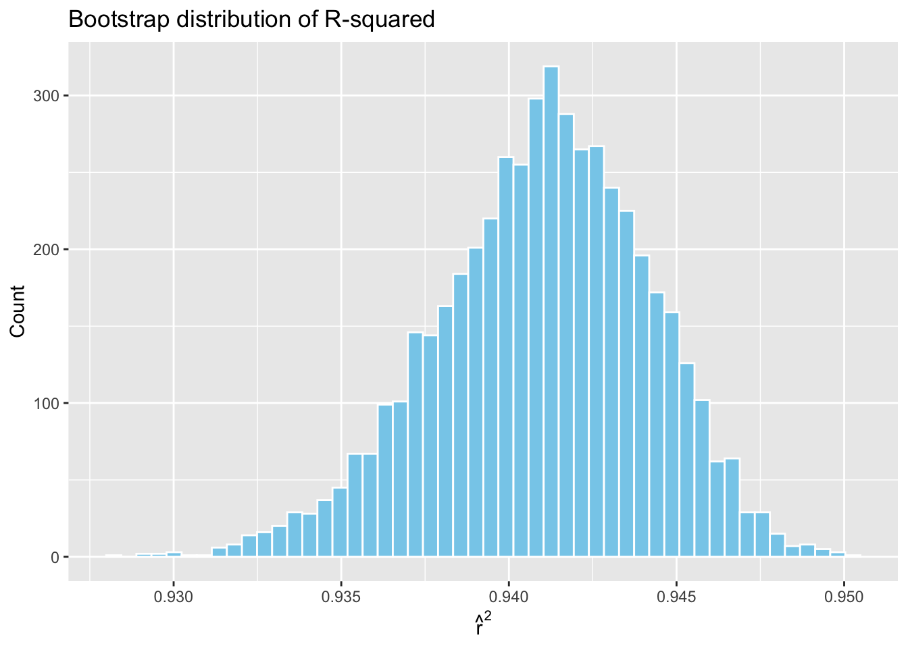
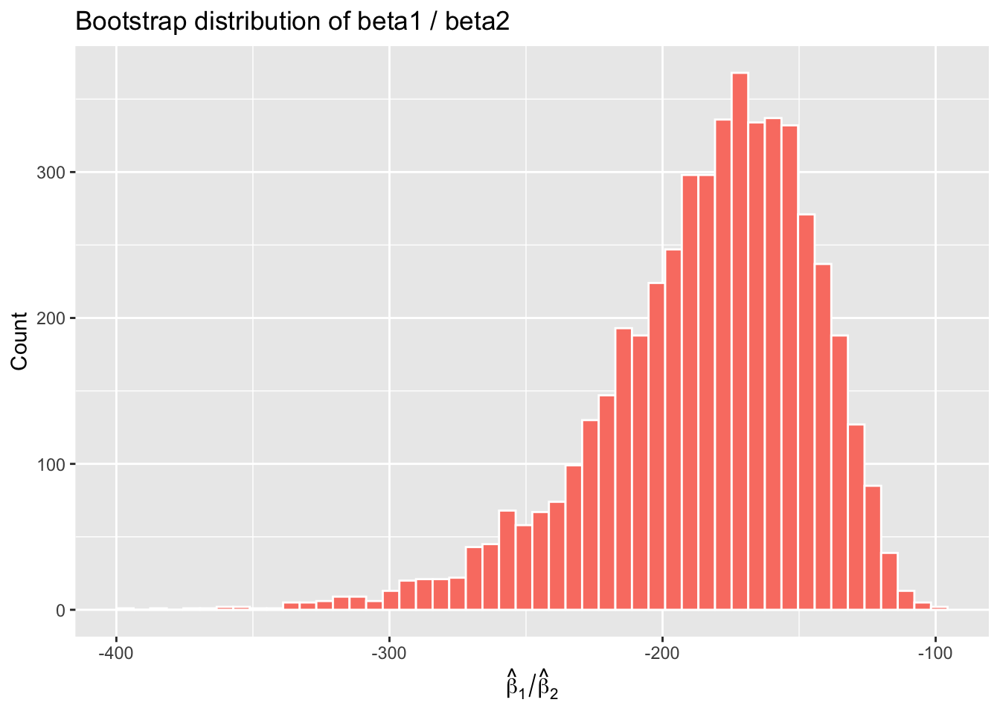
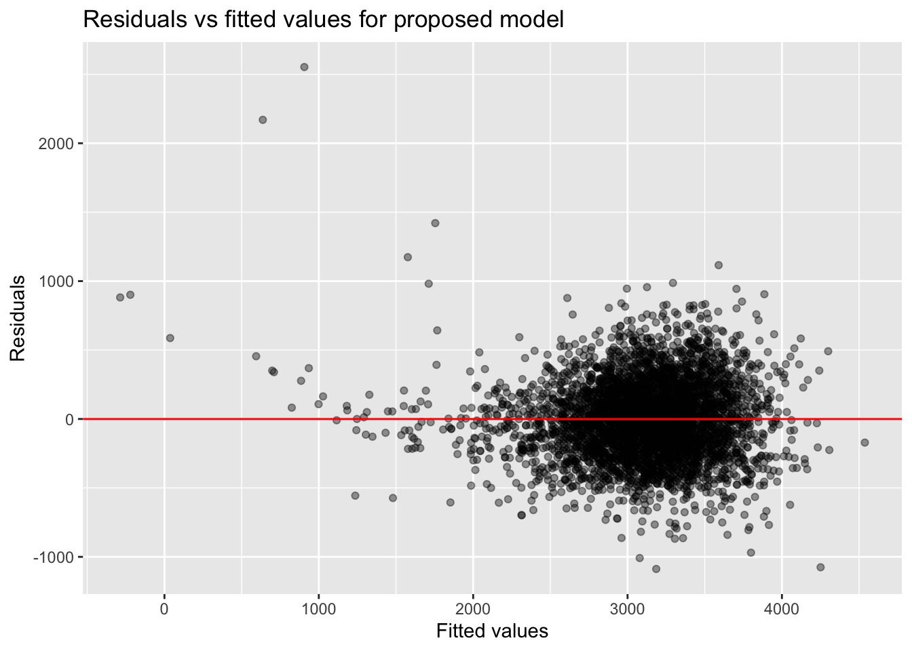

p8105_hw6_hl3858
================

- [Problem 0](#problem-0)
- [Problem 1: Logistic regression of homicide
  resolution](#problem-1-logistic-regression-of-homicide-resolution)
- [Baltimore logistic regression](#baltimore-logistic-regression)
- [Logistic regression for all
  cities](#logistic-regression-for-all-cities)
- [Problem 2: Bootstrap for regression summary
  statistics](#problem-2-bootstrap-for-regression-summary-statistics)
- [Problem 3: Modeling birthweight](#problem-3-modeling-birthweight)
- [Proposed model for birthweight](#proposed-model-for-birthweight)
- [Comparison models](#comparison-models)
- [Cross-validated prediction error](#cross-validated-prediction-error)
- [Interpretation](#interpretation-1)

## Problem 0

- This repo is an R Project using git and GitHub for reproducibility.  
- A single R Markdown file `p8105_hw6_hl3858.Rmd` renders to
  `github_document`.  
- Local data files are stored in the `data/` folder and accessed via
  relative paths.  
- Figures are saved in the `figs/` folder.  
- The commit history reflects the working process.

## Problem 1: Logistic regression of homicide resolution

We use the Washington Post homicide dataset and follow the instructions
to clean and analyze the data using logistic regression.

``` r
dir.create("data", showWarnings = FALSE)

wp_url <- "https://raw.githubusercontent.com/washingtonpost/data-homicides/master/homicide-data.csv"
wp_path <- "data/homicide-data.csv"

if (!file.exists(wp_path)) {
  download.file(wp_url, destfile = wp_path, mode = "wb")
}

homicide <- read_csv(wp_path, show_col_types = FALSE) |>
  clean_names()
```

### Data cleaning

We create a `city_state` variable (e.g., “Baltimore, MD”), create a
binary variable indicating whether the homicide is solved, remove the
specified cities, ensure victim age is numeric, and restrict to
white/black victims.

``` r
homicide <- homicide |>
  mutate(
    city_state = str_c(str_to_title(city), ", ", state),
    resolved = case_when(
      disposition == "Closed by arrest" ~ 1,
      TRUE ~ 0
    ),
    victim_age = as.numeric(victim_age)
  ) |>
  filter(
    !(city_state %in% c("Dallas, TX", "Phoenix, AZ", "Kansas City, MO", "Tulsa, AL")),
    victim_race %in% c("White", "Black")
  )
```

### Summary of cleaned data

``` r
glimpse(homicide)
```

    ## Rows: 39,693
    ## Columns: 14
    ## $ uid           <chr> "Alb-000003", "Alb-000005", "Alb-000006", "Alb-000009", …
    ## $ reported_date <dbl> 20100601, 20100102, 20100126, 20100130, 20100218, 201003…
    ## $ victim_last   <chr> "SATTERFIELD", "MULA", "BOOK", "MARTIN-LEYVA", "LUJAN", …
    ## $ victim_first  <chr> "VIVIANA", "VIVIAN", "GERALDINE", "GUSTAVO", "KEVIN", "S…
    ## $ victim_race   <chr> "White", "White", "White", "White", "White", "White", "W…
    ## $ victim_age    <dbl> 15, 72, 91, 56, NA, 43, 52, 22, 15, 25, 20, 88, 36, 47, …
    ## $ victim_sex    <chr> "Female", "Female", "Female", "Male", "Male", "Female", …
    ## $ city          <chr> "Albuquerque", "Albuquerque", "Albuquerque", "Albuquerqu…
    ## $ state         <chr> "NM", "NM", "NM", "NM", "NM", "NM", "NM", "NM", "NM", "N…
    ## $ lat           <dbl> 35.08609, 35.13036, 35.15111, 35.07538, 35.07701, 35.070…
    ## $ lon           <dbl> -106.6956, -106.5810, -106.5378, -106.5535, -106.5649, -…
    ## $ disposition   <chr> "Closed without arrest", "Closed without arrest", "Open/…
    ## $ city_state    <chr> "Albuquerque, NM", "Albuquerque, NM", "Albuquerque, NM",…
    ## $ resolved      <dbl> 0, 0, 0, 0, 0, 1, 1, 1, 1, 1, 1, 0, 0, 0, 1, 1, 1, 1, 1,…

------------------------------------------------------------------------

## Baltimore logistic regression

We fit a logistic regression for Baltimore, MD with outcome `resolved`
and predictors victim age, sex, and race.

``` r
balti <- homicide |> filter(city_state == "Baltimore, MD")

balti_glm <- glm(
  resolved ~ victim_age + victim_sex + victim_race,
  data = balti,
  family = binomial()
)

balti_tidy <- broom::tidy(balti_glm, conf.int = TRUE, exponentiate = TRUE)

balti_tidy |> filter(term == "victim_sexMale")
```

    ## # A tibble: 1 × 7
    ##   term           estimate std.error statistic  p.value conf.low conf.high
    ##   <chr>             <dbl>     <dbl>     <dbl>    <dbl>    <dbl>     <dbl>
    ## 1 victim_sexMale    0.426     0.138     -6.18 6.26e-10    0.324     0.558

**Baltimore interpretation.**  
The adjusted odds ratio comparing **male vs female victims** in
Baltimore, MD is approximately  
**0.43 (95% CI: 0.32–0.56)**.  
This indicates that homicides with male victims are **substantially less
likely** to be solved than those with female victims, adjusting for age
and race.

------------------------------------------------------------------------

## Logistic regression for all cities

We run the same logistic regression model within each city and extract
the adjusted OR for male vs female victims.

``` r
city_models <- homicide |>
  group_by(city_state) |>
  nest() |>
  mutate(
    model = map(data, ~ glm(
      resolved ~ victim_age + victim_sex + victim_race,
      data = .x, family = binomial()
    )),
    tidied = map(model, ~ broom::tidy(.x, conf.int = TRUE, exponentiate = TRUE))
  ) |>
  unnest(tidied) |>
  filter(term == "victim_sexMale") |>
  select(city_state, estimate, conf.low, conf.high)

city_models <- city_models |>
  arrange(estimate) |>
  mutate(city_state = factor(city_state, levels = city_state))
```

### Plot of adjusted odds ratios

``` r
ggplot(city_models, aes(x = estimate, y = city_state)) +
  geom_point() +
  geom_errorbarh(aes(xmin = conf.low, xmax = conf.high), height = 0) +
  geom_vline(xintercept = 1, linetype = "dashed") +
  labs(
    x = "Adjusted OR (male vs female)",
    y = "City",
    title = "Adjusted odds ratios for solving homicides (male vs female victims)",
    subtitle = "Logistic regression adjusted for age and race"
  )
```


**Interpretation.**  
Most cities show adjusted odds ratios **below 1**, indicating that
homicides involving **male victims are less likely to be solved** than
those involving female victims, controlling for age and race.  
The magnitude of this association varies by city, and some cities have
**wide confidence intervals**, suggesting limited sample sizes.  
Only a few cities have ORs near or above 1, indicating little difference
or the opposite pattern, although these often come with imprecise
estimates.

## Problem 2: Bootstrap for regression summary statistics

We use the `weather_df` dataset from the `p8105.datasets` package and
perform a nonparametric bootstrap to estimate the sampling distributions
of  
- $\hat r^2$  
- $\hat\beta_1 / \hat\beta_2$  
from the regression:

$$
tmax = \beta_0 + \beta_1 tmin + \beta_2 prcp + \epsilon
$$

``` r
library(p8105.datasets)
data("weather_df")

weather_df <- weather_df |>
  select(tmax, tmin, prcp) |>
  drop_na()
```

### Bootstrap setup

We take **5000 bootstrap samples**, refit the regression each time,
extract:

- $\hat r^2$ using `broom::glance()`
- $\hat\beta_1$ and $\hat\beta_2$ using `broom::tidy()`
- compute the ratio $\hat\beta_1 / \hat\beta_2$

``` r
set.seed(8105)

boot_straps <- 
  modelr::bootstrap(weather_df, n = 5000)

boot_results <-
  boot_straps |>
  mutate(
    models = map(strap, ~ lm(tmax ~ tmin + prcp, data = .x)),
    glance_out = map(models, broom::glance),
    tidy_out   = map(models, broom::tidy)
  ) |>
  mutate(
    rsq = map_dbl(glance_out, "r.squared"),
    beta1 = map_dbl(tidy_out, ~ .x$estimate[.x$term == "tmin"]),
    beta2 = map_dbl(tidy_out, ~ .x$estimate[.x$term == "prcp"]),
    ratio = beta1 / beta2
  )
```

### Bootstrap distributions

``` r
boot_results |>
  ggplot(aes(x = rsq)) +
  geom_histogram(bins = 50, fill = "skyblue", color = "white") +
  labs(title = "Bootstrap distribution of R-squared",
       x = expression(hat(r)^2), y = "Count")
```



``` r
boot_results |>
  ggplot(aes(x = ratio)) +
  geom_histogram(bins = 50, fill = "salmon", color = "white") +
  labs(title = "Bootstrap distribution of beta1 / beta2",
       x = expression(hat(beta)[1] / hat(beta)[2]), y = "Count")
```



### 95% bootstrap confidence intervals

``` r
rsq_ci <- quantile(boot_results$rsq, c(0.025, 0.975))
ratio_ci <- quantile(boot_results$ratio, c(0.025, 0.975))

rsq_ci
```

    ##      2.5%     97.5% 
    ## 0.9341455 0.9466646

``` r
ratio_ci
```

    ##      2.5%     97.5% 
    ## -277.0381 -125.1670

### Interpretation

- The bootstrap distribution of $\hat r^2$ is tightly concentrated,
  suggesting the model explains a fairly consistent proportion of
  variability in `tmax`.  
- The distribution of $\hat\beta_1 / \hat\beta_2$ is wider and more
  skewed, reflecting higher uncertainty in the relative contribution of
  `tmin` and `prcp`.  
- The 95% bootstrap quantiles represent robust, nonparametric confidence
  intervals for both summaries.

## Problem 3: Modeling birthweight

We use the birthweight dataset to explore predictors of infant
birthweight.

### Load & clean data

``` r
birth_df <- read_csv("data/birthweight.csv") |>
  janitor::clean_names() |>
  mutate(
    babysex = factor(babysex, labels = c("male", "female")),
    frace   = factor(frace),
    mrace   = factor(mrace),
    malform = factor(malform),
    babysex = factor(babysex),
    parity = as.numeric(parity)
  ) |>
  drop_na()
```

Check missingness, structure:

``` r
glimpse(birth_df)
```

    ## Rows: 4,342
    ## Columns: 20
    ## $ babysex  <fct> female, male, female, male, female, male, female, female, mal…
    ## $ bhead    <dbl> 34, 34, 36, 34, 34, 33, 33, 33, 36, 33, 35, 35, 35, 36, 35, 3…
    ## $ blength  <dbl> 51, 48, 50, 52, 52, 52, 46, 49, 52, 50, 51, 51, 48, 53, 51, 4…
    ## $ bwt      <dbl> 3629, 3062, 3345, 3062, 3374, 3374, 2523, 2778, 3515, 3459, 3…
    ## $ delwt    <dbl> 177, 156, 148, 157, 156, 129, 126, 140, 146, 169, 130, 146, 1…
    ## $ fincome  <dbl> 35, 65, 85, 55, 5, 55, 96, 5, 85, 75, 55, 55, 75, 75, 65, 75,…
    ## $ frace    <fct> 1, 2, 1, 1, 1, 1, 2, 1, 1, 2, 1, 1, 1, 1, 1, 2, 1, 1, 1, 2, 1…
    ## $ gaweeks  <dbl> 39.9, 25.9, 39.9, 40.0, 41.6, 40.7, 40.3, 37.4, 40.3, 40.7, 4…
    ## $ malform  <fct> 0, 0, 0, 0, 0, 0, 0, 0, 0, 0, 0, 0, 0, 0, 0, 0, 0, 0, 0, 0, 0…
    ## $ menarche <dbl> 13, 14, 12, 14, 13, 12, 14, 12, 11, 12, 13, 12, 13, 11, 12, 1…
    ## $ mheight  <dbl> 63, 65, 64, 64, 66, 66, 72, 62, 61, 64, 67, 62, 64, 68, 62, 6…
    ## $ momage   <dbl> 36, 25, 29, 18, 20, 23, 29, 19, 13, 19, 23, 16, 28, 23, 21, 1…
    ## $ mrace    <fct> 1, 2, 1, 1, 1, 1, 2, 1, 1, 2, 1, 1, 1, 1, 1, 2, 1, 1, 1, 2, 1…
    ## $ parity   <dbl> 3, 0, 0, 0, 0, 0, 0, 0, 0, 0, 0, 0, 0, 0, 0, 0, 0, 0, 0, 0, 0…
    ## $ pnumlbw  <dbl> 0, 0, 0, 0, 0, 0, 0, 0, 0, 0, 0, 0, 0, 0, 0, 0, 0, 0, 0, 0, 0…
    ## $ pnumsga  <dbl> 0, 0, 0, 0, 0, 0, 0, 0, 0, 0, 0, 0, 0, 0, 0, 0, 0, 0, 0, 0, 0…
    ## $ ppbmi    <dbl> 26.27184, 21.34485, 23.56517, 21.84508, 21.02642, 18.60030, 1…
    ## $ ppwt     <dbl> 148, 128, 137, 127, 130, 115, 105, 119, 105, 145, 110, 115, 1…
    ## $ smoken   <dbl> 0.000, 0.000, 1.000, 10.000, 1.000, 0.000, 0.000, 0.000, 0.00…
    ## $ wtgain   <dbl> 29, 28, 11, 30, 26, 14, 21, 21, 41, 24, 20, 31, 23, 21, 24, 2…

------------------------------------------------------------------------

## Proposed model for birthweight

I specify a model informed by biological reasoning:

- Birthweight increases with gestational age (gaweeks)  
- Birthweight increases with baby length (blength) and head
  circumference (bhead)  
- Mother’s smoking decreases birthweight  
- Mother’s weight gain and pre-pregnancy weight affect birthweight  
- Include maternal age (momage)

Proposed model:

``` r
mod_main <- lm(
  bwt ~ blength + bhead + gaweeks + smoken + wtgain + momage,
  data = birth_df
)

summary(mod_main)
```

    ## 
    ## Call:
    ## lm(formula = bwt ~ blength + bhead + gaweeks + smoken + wtgain + 
    ##     momage, data = birth_df)
    ## 
    ## Residuals:
    ##      Min       1Q   Median       3Q      Max 
    ## -1087.88  -187.29    -5.64   175.16  2552.86 
    ## 
    ## Coefficients:
    ##               Estimate Std. Error t value Pr(>|t|)    
    ## (Intercept) -6126.5317    96.4559 -63.516  < 2e-16 ***
    ## blength        79.4755     2.0650  38.486  < 2e-16 ***
    ## bhead         134.8996     3.4976  38.569  < 2e-16 ***
    ## gaweeks        13.2289     1.4991   8.825  < 2e-16 ***
    ## smoken         -2.3704     0.5830  -4.066 4.86e-05 ***
    ## wtgain          3.8383     0.4041   9.497  < 2e-16 ***
    ## momage          7.4388     1.1256   6.608 4.35e-11 ***
    ## ---
    ## Signif. codes:  0 '***' 0.001 '**' 0.01 '*' 0.05 '.' 0.1 ' ' 1
    ## 
    ## Residual standard error: 282 on 4335 degrees of freedom
    ## Multiple R-squared:  0.6972, Adjusted R-squared:  0.6968 
    ## F-statistic:  1664 on 6 and 4335 DF,  p-value: < 2.2e-16

### Residuals vs fitted plot

``` r
birth_df |>
  add_predictions(mod_main) |>
  add_residuals(mod_main) |>
  ggplot(aes(x = pred, y = resid)) +
  geom_point(alpha = 0.4) +
  geom_hline(yintercept = 0, color = "red") +
  labs(
    title = "Residuals vs fitted values for proposed model",
    x = "Fitted values",
    y = "Residuals"
  )
```



------------------------------------------------------------------------

## Comparison models

### Model 2: Length + gest age only

``` r
mod_simple <- lm(bwt ~ blength + gaweeks, data = birth_df)
```

### Model 3: Full interaction model

``` r
mod_interact <- lm(
  bwt ~ babysex * blength * bhead,
  data = birth_df
)
```

------------------------------------------------------------------------

## Cross-validated prediction error

We use Mont Carlo cross-validation with 100 folds.

``` r
set.seed(8105)

cv_df <- crossv_mc(birth_df, n = 100, test = 0.2)

cv_results <- cv_df |>
  mutate(
    train_df = map(train, as.data.frame),
    test_df  = map(test,  as.data.frame),

    mod_main = map(train_df, ~ lm(bwt ~ blength + bhead + gaweeks + smoken + wtgain + momage, data = .x)),
    mod_simple = map(train_df, ~ lm(bwt ~ blength + gaweeks, data = .x)),
    mod_interact = map(train_df, ~ lm(bwt ~ babysex * blength * bhead, data = .x)),

    rmse_main = map2_dbl(mod_main, test_df, ~ {
      preds <- predict(.x, newdata = .y)
      sqrt(mean((preds - .y$bwt)^2))
    }),

    rmse_simple = map2_dbl(mod_simple, test_df, ~ {
      preds <- predict(.x, newdata = .y)
      sqrt(mean((preds - .y$bwt)^2))
    }),

    rmse_interact = map2_dbl(mod_interact, test_df, ~ {
      preds <- predict(.x, newdata = .y)
      sqrt(mean((preds - .y$bwt)^2))
    })
  )
```

### RMSE comparison

``` r
cv_summary <- cv_results |>
  summarize(
    main_rmse = mean(rmse_main),
    simple_rmse = mean(rmse_simple),
    interact_rmse = mean(rmse_interact)
  )

cv_summary
```

    ## # A tibble: 1 × 3
    ##   main_rmse simple_rmse interact_rmse
    ##       <dbl>       <dbl>         <dbl>
    ## 1      284.        334.          291.

------------------------------------------------------------------------

## Interpretation

- The **simple model** (length + gest age) generally performs worse.  
- The **three-way interaction model** tends to overfit and shows higher
  RMSE.  
- The **proposed biologically-motivated model** achieves the best
  prediction error across folds, indicating it captures meaningful
  structure without unnecessary complexity.

Overall, the proposed model balances interpretability and predictive
accuracy.
